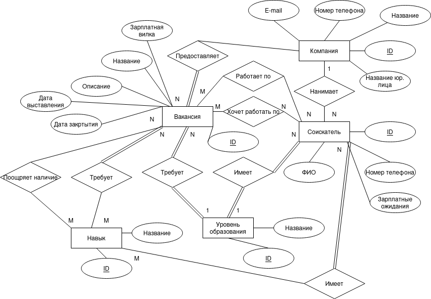
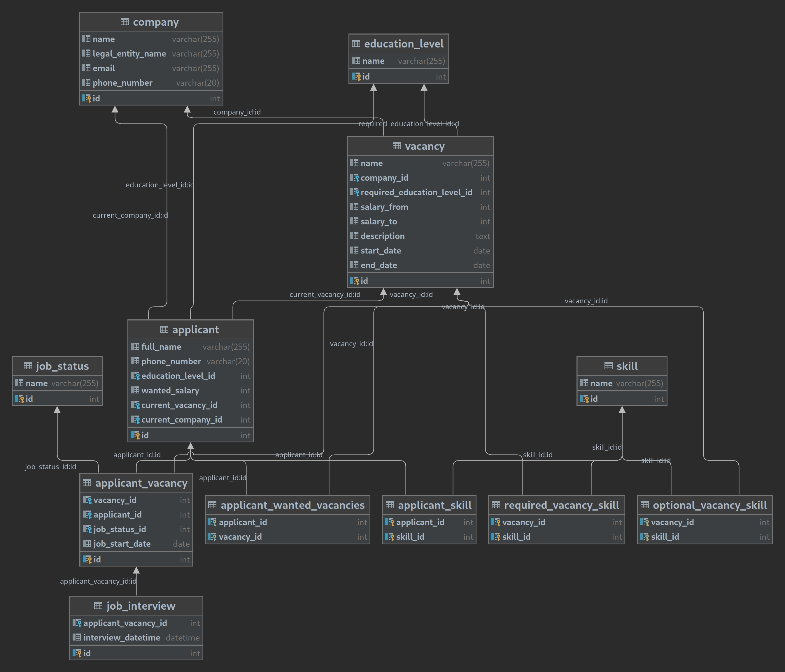
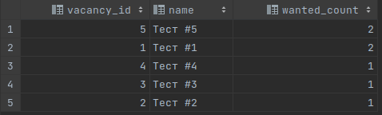

# <span style="font-family: Times New Roman;">Инфологическая модель</span>


# <span style="font-family: Times New Roman;">Даталогическая модель</span>

<span style="font-family: Times New Roman,serif; font-size: 14pt">Запрос для создания таблиц представлен в файле schema.sql</span>

# <span style="font-family: Times New Roman;">Прототипы веб-страниц</span>


# <span style="font-family: Times New Roman;">Алгоритм подбора кандидатов</span>
1. <span style="font-family: Times New Roman,serif; font-size: 14pt">Отобрать кандидатов по совпадающему набору требуемых навыков. Если полного совпадения нет, то выбрать с наибольшим количеством совпадений.</span>
2. <span style="font-family: Times New Roman,serif; font-size: 14pt">Среди выбранных кандидатов выбрать тех, кто хотел эту вакансию. Если таких нет, то опираться на зарплатные ожидания.</span>
3. <span style="font-family: Times New Roman,serif; font-size: 14pt">Если по результатам предыдущего шага осталось несколько кандидатов, то выбрать по совпадениям дополнительных навыков.</span>

<span style="font-family: Times New Roman,serif; font-size: 14pt">Для лучшего подбора можно дополнить модель данных важностью (весами) навыков для вакансии, 
и при поиске частичных совпадений по навыкам считать сумму весов вместо количества.
</span>

# <span style="font-family: Times New Roman;">SQL для топ-5 вакансий конкретной компании</span>
```sqlite
select vacancy_id, name, count(*) as wanted_count
from applicant_wanted_vacancy
inner join vacancy v on applicant_wanted_vacancy.vacancy_id = v.id
where v.company_id = 1
group by vacancy_id
order by wanted_count desc limit 5;
```
<span style="font-family: Times New Roman; font-size: 14pt">Для простоты и наглядности ID компании был жестко задан, 
в реальности его нужно будет передать в prepared statement или в параметр хранимой функции.</span>
## <span style="font-family: Times New Roman;">Пример вывода запроса на тестовых данных</span>
<span style="font-family: Times New Roman; font-size: 14pt">Команды для создания данных представлены в файле create_data.sql.</span>
